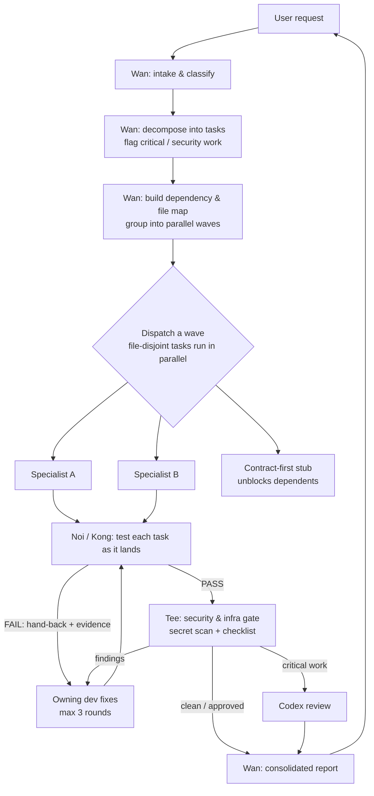

# HMS CNX — Team Workflow

How a request flows through the team, from intake to delivery. Wan (the PM) owns this
pipeline; each specialist runs its own role workflow (see `agents/<nick>.md`).

## End-to-end flow

## Phases

1. **Intake** — Wan reads the request and safely inspects repo context (never secret files), and classifies the work and the stacks/files touched.
2. **Plan** — Wan decomposes the request into discrete tasks, recording for each: owner, files touched, dependencies, and whether it is critical/security-sensitive (auth, authz, payments, DB migrations, K8s, Terraform, CI/CD, CDC/Kafka, distributed systems, large refactors).
3. **Wave map** — tasks with disjoint file sets and no dependency are grouped into the same wave and run in parallel; tasks that share a file or depend on another's output move to a later wave. Each file has at most one owner in flight. Contract-first stubs convert a dependency into parallel work.
4. **Dispatch** — Wan spawns each wave's specialists concurrently with a scoped brief (goal, files in scope, constraints, acceptance criteria).
5. **Per-task QA loop** — as each dev task lands, Noi (manual/Playwright) and/or Kong (automated) tests it. On FAIL the task bounces back to the owning dev with evidence; the loop runs up to 3 rounds, then Wan escalates to the user. QA of one task never blocks unrelated in-flight tasks.
6. **Security & infra gate** — Tee scans all diffs for secrets, runs the security checklist, and assesses CI/CD & infra impact. Critical work is routed to Codex review before "done".
7. **Report** — Wan consolidates: files changed, behavior changed, commands & tests run + results, security notes, performance notes, risks, next steps.

## Collaboration rules

- **One owner per file per wave** — two agents never edit the same file at the same time.
- **Parallel by default** — disjoint-file tasks run together; only shared-file or dependent tasks serialize into later waves.
- **Contract-first** — define an interface/stub so frontend and backend can build in parallel.
- **Per-task QA** — each task is tested as it lands, not batched.
- **Fail-loop cap** — 3 rounds, then Wan escalates to the user.
- **Critical work** — auth/payments/migrations/infra go through Tee + Codex before "done".
- **Secret safety** — no member reads `.env`/credentials/keys/kubeconfig/tokens; secret values are never printed.

## Each member's own workflow (summary)

| Member | Workflow shape |
|--------|----------------|
| Wan | intake → plan → wave map → dispatch → per-task QA loop → Tee gate → consolidated report |
| Ninja / Bew / Oat / Guitar / Ohm | receive brief → investigate → (define/honor contract) → implement (minimal diff) → self-verify → hand to QA → fix-loop on bounce-back → escalate when blocked/critical |
| Noi | receive deliverable → derive cases → execute & capture evidence → verdict → write report → hand-back on FAIL → re-test until PASS or round 3 |
| Kong | receive deliverable → detect framework → author tests → run & capture → register → hand-back on FAIL → re-run until green or round 3 |
| Tee | collect diffs → secret scan → security checklist → infra/CI-CD impact → verdict + Codex routing → re-review after fixes → go/no-go |

Full per-agent detail lives in each `agents/<nick>.md` `<Work_Protocol>` section.
