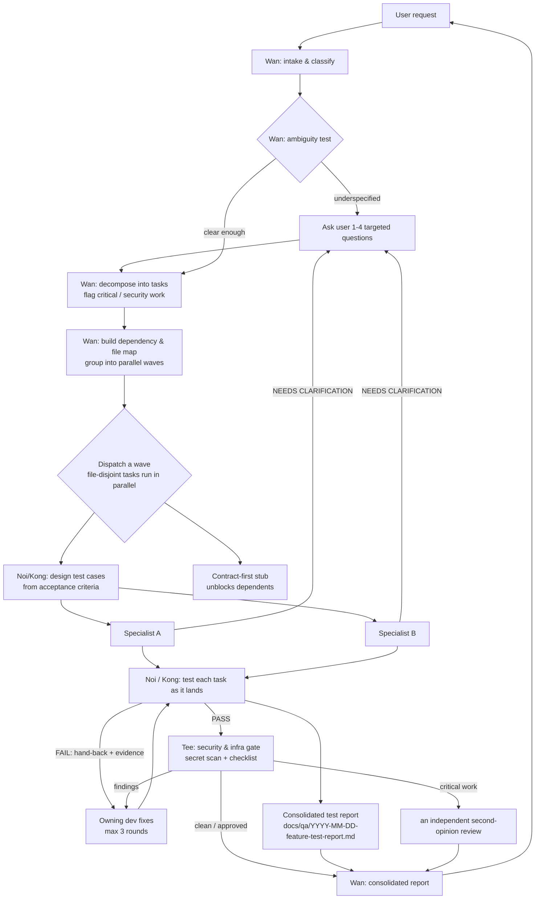

# Only CNX — Team Workflow

How a request flows through the team, from intake to delivery. Wan (the PM) owns this
pipeline; each specialist runs its own role workflow (see `agents/<nick>.md`).

## End-to-end flow

## Phases

1. **Intake & recall** — Wan reads the request and safely inspects repo context (never secret files), classifies the work and the stacks/files touched, and **recalls team memory** — resolving the durable vault (`$ONLY_CNX_MEMORY` → `.only-cnx/memory/`) and reading relevant Decisions/Conventions/Contracts/QA-History so known knowledge isn't re-derived.
2. **Clarify (intake gate)** — Wan applies the ambiguity test. If the request is underspecified (missing acceptance criteria, a consequential decision with no default, conflicting or missing inputs), Wan asks the user a small batch of targeted questions before planning; otherwise it proceeds and records assumptions. A specialist that hits a blocking unknown mid-run returns a `NEEDS CLARIFICATION` note and Wan re-dispatches after the user answers. (Clarification is return-early + re-dispatch — subagents can't pause.)
3. **Plan** — Wan decomposes the request into discrete tasks, recording for each: owner, files touched, dependencies, and whether it is critical/security-sensitive (auth, authz, payments, DB migrations, K8s, Terraform, CI/CD, CDC/Kafka, distributed systems, large refactors).
4. **Wave 0 — freeze contract + design test cases** — once tasks and their acceptance criteria are set, Wan freezes any API contracts and dispatches Noi/Kong to author test cases from each task's acceptance criteria (**test-case design (shift-left)**). This is a **soft gate**: devs start as soon as cases are drafted; no hard wait on QA. Planned cases are recorded in the consolidated test report's "Planned test cases" section and in `.only-cnx/run/test-plan.md` when the scratchpad exists.
5. **Wave map** — tasks with disjoint file sets and no dependency are grouped into the same wave and run in parallel; tasks that share a file or depend on another's output move to a later wave. Each file has at most one owner in flight. Contract-first stubs convert a dependency into parallel work.
6. **Dispatch** — Wan spawns each wave's specialists concurrently with a scoped brief (goal, files in scope, constraints, acceptance criteria, and the planned test cases as the bar to build to). Use the dispatch templates in `skills/only-cnx/templates/` (`brief.md`, `contract.md`).
7. **Per-task QA loop** — as each dev task lands, Noi (manual/Playwright) and/or Kong (automated) tests it. On FAIL the task bounces back to the owning dev with evidence; the loop runs up to 3 rounds, then Wan escalates to the user. QA of one task never blocks unrelated in-flight tasks.
8. **Security & infra gate** — Tee scans all diffs for secrets, runs the security checklist, and assesses CI/CD & infra impact. Critical work is routed to an independent second-opinion review before "done".
9. **Encode & report** — Wan **encodes** durable learnings (decisions, conventions, lasting contracts, QA gotchas) into the vault when memory is ON, updates `MEMORY.md`, and rolls the run scratchpad — placeholders only, never secrets. Then consolidates: files changed, behavior changed, commands & tests run + results, security notes, performance notes, memory recalled/encoded, risks, next steps. The **consolidated test report** (`docs/qa/YYYY-MM-DD-<feature>-test-report.md`) — assembled by Wan from Noi's and Kong's returned results — is included in the final report.

## Collaboration rules

- **Test-first (shift-left)** — QA authors test cases from the acceptance criteria at Wave 0, before dev (soft gate); the same cases are executed after build and rolled into one consolidated test report.
- **Clarify before guessing** — Wan runs an ambiguity test at intake and asks the user about blocking unknowns; specialists return a `NEEDS CLARIFICATION` note (dispatched) or ask the user (direct) rather than guessing consequential decisions. Cheap, reversible unknowns get a sensible default + a stated assumption.
- **One owner per file per wave** — two agents never edit the same file at the same time.
- **Parallel by default** — disjoint-file tasks run together; only shared-file or dependent tasks serialize into later waves.
- **Contract-first** — define an interface/stub so frontend and backend can build in parallel.
- **Per-task QA** — each task is tested as it lands, not batched.
- **Fail-loop cap** — 3 rounds, then Wan escalates to the user.
- **Critical work** — auth/payments/migrations/infra go through Tee plus an independent second-opinion review before "done".
- **Secret safety** — no member reads `.env`/credentials/keys/kubeconfig/tokens; secret values are never printed.
- **Shared baseline** — every member loads the `engineering-practices` skill (definition of done, review culture, testing pyramid, secret safety, Context7 docs-check reflex) alongside their role skill.
- **Current docs over memory** — before using an unfamiliar or upgraded library API, dev members (Bew, Oat, Guitar, Ninja, Ohm) and Kong check version-accurate docs via the bundled Context7 MCP.
- **Team memory** — Wan recalls durable knowledge (an Obsidian vault when valid, else the run scratchpad) at intake and encodes learnings at report time. Live run state — wave map, frozen contracts, QA status — lives in the gitignored `.only-cnx/run/`; specialists read their slice and never write secrets to it. See the `team-memory` skill.

## Each member's own workflow (summary)

| Member | Workflow shape |
|--------|----------------|
| Wan | intake **& recall** → plan → wave map → dispatch → per-task QA loop → Tee gate → **encode** → consolidated report |
| Ninja / Bew / Oat / Guitar / Ohm | receive brief → investigate → (define/honor contract) → implement (minimal diff) → self-verify → hand to QA → fix-loop on bounce-back → escalate when blocked/critical |
| Noi | receive deliverable → derive cases → execute & capture evidence → verdict → write report → hand-back on FAIL → re-test until PASS or round 3 |
| Kong | receive deliverable → detect framework → author tests → run & capture → register → hand-back on FAIL → re-run until green or round 3 |
| Tee | collect diffs → secret scan → security checklist → infra/CI-CD impact → verdict + second-opinion routing → re-review after fixes → go/no-go |

Full per-agent detail lives in each `agents/<nick>.md` `<Work_Protocol>` section.
